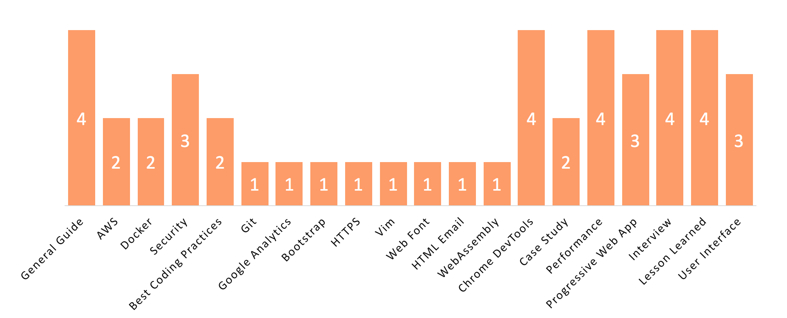

# learn-web-development
Learn Web Development from Top Articles of 2017

</a>

Between Jan~Dec 2017, we’ve compared nearly 16,000 Web Development articles to pick the Top 45.

We believe learning from web developers who have hands-on experience in the field is a great way to advance your career. This directory is designed to make your life easier as it organizes the most useful tutorials written in 2017, where experienced web developers share their lessons in building and shipping a web application..

This directory has 20 key topics:

</a>

If you want a version with images: [Go to our Medium link](https://goo.gl/oh4HXE)

 

## Table of Contents
1. [General Guide](#general-guide)
1. [AWS](#aws)
1. [Docker](#docker)
1. [Security](#security)
1. [Best Coding Practices](#best-coding-practices)
1. [Git](#git)
1. [Google Analytics](#google-analytics)
1. [Bootstrap](#bootstrap)
1. [HTTPS](#https)
1. [Vim](#vim)
1. [Web Font](#web-font)
1. [HTML Email](#html-email)
1. [WebAssembly](#webassembly)
1. [Chrome DevTools](#chrome-devtools)
1. [Case Study](#case-study)
1. [Performance](#performance)
1. [Progressive Web App](#progressive-web-app)
1. [Interview](#interview)
1. [Lesson Learned](#lesson-learned)
1. [User Interface](#user-interface)
 

### Recommended Learning

A) Gaming AI: [The Beginner’s Guide to Building an Artificial Intelligence in Unity.](http://bit.ly/2nbsc5n)

5,041 recommends, 4.7/5 stars

B) Computer Vision: [Deep Learning and Computer Vision A-Z™: Learn OpenCV, SSD & GANs and create image recognition apps.](http://bit.ly/2DGORkq)

8,161 recommends, 4.5/5 stars

 

### General Guide
* [Front-end Developer Handbook 2017 - Cody Lindley](https://frontendmasters.gitbooks.io/front-end-handbook-2017/content?utm_source=mybridge&utm_medium=email&utm_campaign=read_more)
* [Roadmap to becoming a web developer in 2017](https://github.com/kamranahmedse/developer-roadmap?utm_source=mybridge&utm_medium=email&utm_campaign=read_more)
* [Front-End Checklist: The perfect Front-End Checklist for modern websites and meticulous developers](http://frontendchecklist.com/?utm_source=mybridge&utm_medium=email&utm_campaign=read_more)
* [Our 500+ engineers all use this front end development guide](https://medium.freecodecamp.com/grabs-front-end-guide-for-large-teams-484d4033cc41?utm_source=mybridge&utm_medium=email&utm_campaign=read_more)

 

### AWS
* [The Open Guide to Amazon Web Services.](https://github.com/open-guides/og-aws?utm_source=mybridge&utm_medium=email&utm_campaign=read_more)
* [The Hitchhiker's Guide to AWS ECS and Docker](http://start.jcolemorrison.com/the-hitchhikers-guide-to-aws-ecs-and-docker?utm_source=mybridge&utm_medium=email&utm_campaign=read_more)

 

### Docker
* [Here’s How You Start Using Docker](http://djangostars.com/blog/heres-how-you-start-using-docker?utm_source=mybridge&utm_medium=email&utm_campaign=read_more)
* [Docker Introduction](https://tobiastom.name/explains/docker?utm_source=mybridge&utm_medium=email&utm_campaign=read_more)

 

### Security
* [Web Developer Security Checklist](https://simplesecurity.sensedeep.com/web-developer-security-checklist-f2e4f43c9c56?utm_source=mybridge&utm_medium=email&utm_campaign=read_more)
* [Auth-Boss: Learn about different authentication methodologies on the web.](https://github.com/teesloane/Auth-Boss?utm_source=mybridge&utm_medium=email&utm_campaign=read_more)
* [Bypassing Browser Security Warnings with Pseudo Password Fields](https://www.troyhunt.com/bypassing-browser-security-warnings-with-pseudo-password-fields?utm_source=mybridge&utm_medium=email&utm_campaign=read_more)

 

### Best Coding Practices
* [Design Patterns for Programmers](https://github.com/kamranahmedse/design-patterns-for-humans?utm_source=mybridge&utm_medium=email&utm_campaign=read_more)
* [Key software engineering practices at Google [PDF]](https://arxiv.org/abs/1702.01715?utm_source=mybridge&utm_medium=email&utm_campaign=read_more)

 

### Git
* [Git-flight-rules: A guide for programmers using git about what to do when things go wrong.](https://github.com/k88hudson/git-flight-rules?utm_source=mybridge&utm_medium=email&utm_campaign=read_more)

 

### Google Analytics
* [The Google Analytics Setup I Use on Every Site I Build](https://philipwalton.com/articles/the-google-analytics-setup-i-use-on-every-site-i-build?utm_source=mybridge&utm_medium=email&utm_campaign=read_more)

 

### Bootstrap
* [Bootstrap 4: Everything You Need to Know](https://medium.freecodecamp.org/bootstrap-4-everything-you-need-to-know-c750991f6784?utm_source=mybridge&utm_medium=email&utm_campaign=read_more)

 

### HTTPS
* [The 6-Step "Happy Path" to HTTPS](https://www.troyhunt.com/the-6-step-happy-path-to-https?utm_source=mybridge&utm_medium=email&utm_campaign=read_more)

 

### Vim
* [Vim After 15 Years](https://statico.github.io/vim3.html?utm_source=mybridge&utm_medium=email&utm_campaign=read_more)

 

### Web Font
* [Web fonts: when you need them, when you don’t](https://hackernoon.com/web-fonts-when-you-need-them-when-you-dont-a3b4b39fe0ae?utm_source=mybridge&utm_medium=email&utm_campaign=read_more)

 

### HTML Email
* [An Introduction To Building And Sending HTML Email For Web Developers – Smashing Magazine](https://www.smashingmagazine.com/2017/01/introduction-building-sending-html-email-for-web-developers?utm_source=mybridge&utm_medium=email&utm_campaign=read_more)

 

### WebAssembly
* [An Abridged Cartoon Introduction To WebAssembly – Smashing Magazine](https://www.smashingmagazine.com/2017/05/abridged-cartoon-introduction-webassembly?utm_source=mybridge&utm_medium=email&utm_campaign=read_more)

 

### Chrome DevTools
* [Increase your web development skill-set: 150 animated tips on Chrome DevTools](https://medium.com/dev-channel/increase-your-web-development-skill-set-150-animated-tips-on-chrome-devtools-4a30155e6b8e?utm_source=mybridge&utm_medium=email&utm_campaign=read_more)
* [DevTools: State of the Union 2017 (Google I/O '17)](https://www.youtube.com/watch?v=PjjlwAvV8Jg?utm_source=mybridge&utm_medium=email&utm_campaign=read_more)
* [Using Chrome Developer Tools to get tickets to Taylor Swift’s next concert](https://medium.com/@amyngyn/look-what-you-made-me-do-chrome-b85eb2a90540?utm_source=mybridge&utm_medium=email&utm_campaign=read_more)
* [Preload, Prefetch And Priorities in Chrome - Addy Osmani, Staff Engineer at Google](https://medium.com/dev-channel/preload-prefetch-and-priorities-in-chrome-776165961bbf?utm_source=mybridge&utm_medium=email&utm_campaign=read_more)

 

### Case Study
* [How We Built r/Place](http://redditblog.com/2017/04/13/how-we-built-rplace?utm_source=mybridge&utm_medium=email&utm_campaign=read_more)
* [I learned to code, build a web app and launch it on Product Hunt in 2 months](https://medium.com/@AndreyAzimov/i-learned-to-code-and-build-a-web-app-in-2-months-da8f2932c139?utm_source=mybridge&utm_medium=email&utm_campaign=read_more)

 

### Performance
* [The State of the Web: A guide to impactful performance improvements](https://medium.com/@fox/talk-the-state-of-the-web-3e12f8e413b3?utm_source=mybridge&utm_medium=email&utm_campaign=read_more)
* [Essential Image Optimization - Addy Osmani](https://images.guide?utm_source=mybridge&utm_medium=email&utm_campaign=read_more)
* [Web Cache - Everything you need to know](http://kamranahmed.info/blog/2017/03/14/quick-guide-to-http-caching?utm_source=mybridge&utm_medium=email&utm_campaign=read_more)
* [Speed up your site with a little machine learning](https://hackernoon.com/speed-up-your-site-with-a-little-machine-learning-fa9eb7c86dbb?utm_source=mybridge&utm_medium=email&utm_campaign=read_more)

 

### Progressive Web App
* [A Pinterest Progressive Web App Performance Case Study](https://medium.com/@addyosmani/a-pinterest-progressive-web-app-performance-case-study-3bd6ed2e6154?utm_source=mybridge&utm_medium=email&utm_campaign=read_more)
* [A Beginner’s Guide to Progressive Web Apps & the Frontend Web](https://hackernoon.com/a-beginners-guide-to-progressive-web-apps-the-frontend-web-424b6d697e35?utm_source=mybridge&utm_medium=email&utm_campaign=read_more)
* [Production Progressive Web Apps With JavaScript Frameworks (Google I/O '17)](https://www.youtube.com/watch?v=aCMbSyngXB4?utm_source=mybridge&utm_medium=email&utm_campaign=read_more)

 

### Interview
* [I just got a developer job at Facebook. Here’s how I prepped for my interviews.](https://medium.freecodecamp.org/software-engineering-interviews-744380f4f2af?utm_source=mybridge&utm_medium=email&utm_campaign=read_more)
* [The 30-minute guide to rocking your next coding interview](https://medium.freecodecamp.org/coding-interviews-for-dummies-5e048933b82b?utm_source=mybridge&utm_medium=email&utm_campaign=read_more)
* [I just got a developer job at Snapchat. Here’s what I learned and how it can help you with your job search.](https://medium.freecodecamp.com/a-dynamic-framework-for-finding-your-first-programming-job-b4eb0605b4f3?utm_source=mybridge&utm_medium=email&utm_campaign=read_more)
* [Google Coding Interview Question and Answer #1: First Recurring Character](https://www.youtube.com/watch?v=GJdiM-muYqc?utm_source=mybridge&utm_medium=email&utm_campaign=read_more)

 

### Lesson Learned
* [How I would explain a decade of web development to a time traveler from 2007](https://medium.freecodecamp.org/web-development-explained-to-a-time-traveler-from-ten-years-ago-600fad81170d?utm_source=mybridge&utm_medium=email&utm_campaign=read_more)
* [I've been a Web Developer for 17 Years, and this is what I learned - Daniel Khan](http://community.risingstack.com/ive-been-a-web-developer-for-17-years-and-this-is-what-i-learned-daniel-khan?utm_source=mybridge&utm_medium=email&utm_campaign=read_more)
* [The Developer’s Edge: How To Become A Senior Developer](https://hackernoon.com/developers-edge-how-to-become-a-senior-developer-f1ec1738cf45?utm_source=mybridge&utm_medium=email&utm_campaign=read_more)
* [Veteran CTO (with Multiple Successful Exits) Answers Your Top Startup-Building Questions](http://firstround.com/review/veteran-cto-with-20-years-experience-answers-your-top-startup-building-questions?utm_source=mybridge&utm_medium=email&utm_campaign=read_more)

 

### User Interface
* [Rethinking drag and drop: Taking something basic and making it beautiful](https://medium.com/@alexandereardon/rethinking-drag-and-drop-d9f5770b4e6b?utm_source=mybridge&utm_medium=email&utm_campaign=read_more)
* [Expanding Grid Item Animation](https://tympanus.net/codrops/2017/11/08/expanding-grid-item-animation?utm_source=mybridge&utm_medium=email&utm_campaign=read_more)
* [Inspiration for Menu Hover Effects](https://tympanus.net/codrops/2017/08/01/inspiration-for-menu-hover-effects?utm_source=mybridge&utm_medium=email&utm_campaign=read_more)
